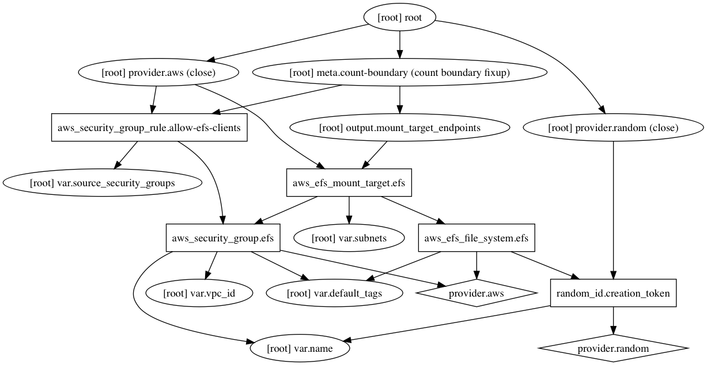

## AWS ElasticFileSystem

#### Inputs required

| Variable | Type | Description |
| --- | --- | --- |
| name | String | All resources are based on this. |
| vpc_id | String | VPC to launch resources in. |
| subnets | List | List of subnets to launch filesystem in. |
| source_security_groups | String | Allow access from these security groups. |
| default_tags | Map | Default tags to add to resources. |

#### How to use

```HCL
module "efs" {
  source                 = "../modules/efs"
  name                   = "${var.name}-efs"
  vpc_id                 = "${module.vpc.vpc_id}"
  subnets                = "${module.vpc.private_subnets}"
  default_tags           = "${var.default_tags}"
  source_security_groups = "${aws_security_group.jenkins.id}"
}
```

#### Dependency Graph

