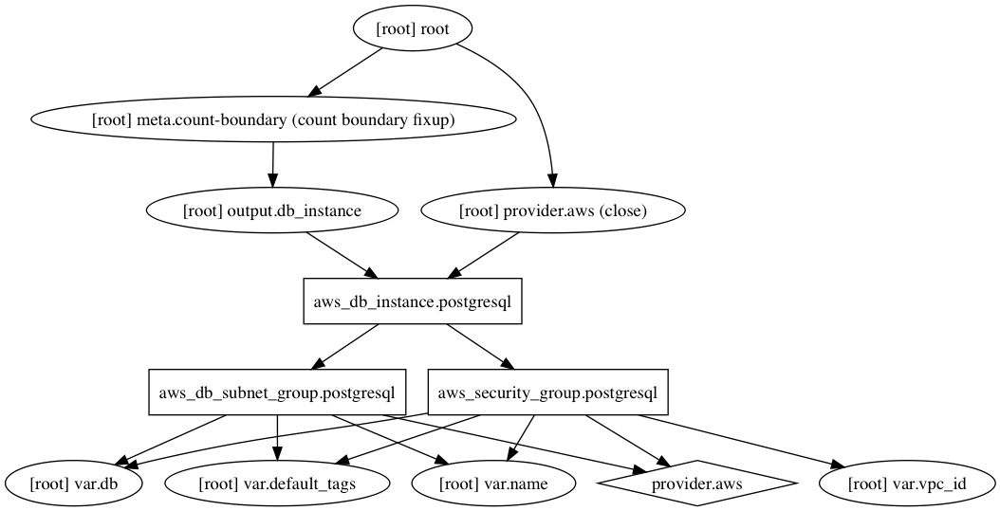

## AWS RDS | postgresql

#### Inputs required

| Variable | Type | Description |
| --- | --- | --- |
| name | String | All resources are based on this. |
| vpc_id | String | VPC to launch resources in. |
| db | Map | Configuration map for postgresql. |
| default_tags | Map | Default tags to add to resources. |

#### How to use

```HCL
module "postgresql" {
  source = "../modules/postgresql"
  name   = "${var.name}"

  vpc_id = "${module.vpc.vpc_id}"

  db = {
    allocated_storage      = "10"
    engine_version         = "9.6.2"
    instance_class         = "db.t2.micro"
    password               = "${var.sonarqube_db_password}"
    username               = "${var.sonarqube_db_user}"
    name                   = "${var.sonarqube_db_name}"
    multi_az               = false
    port                   = 5432
    subnets                = "${join(",", module.vpc.private_subnets)}"
    source_security_groups = "${aws_security_group.jenkins.id}"
  }

  default_tags = "${var.default_tags}"
}
```

#### Dependency Graph

